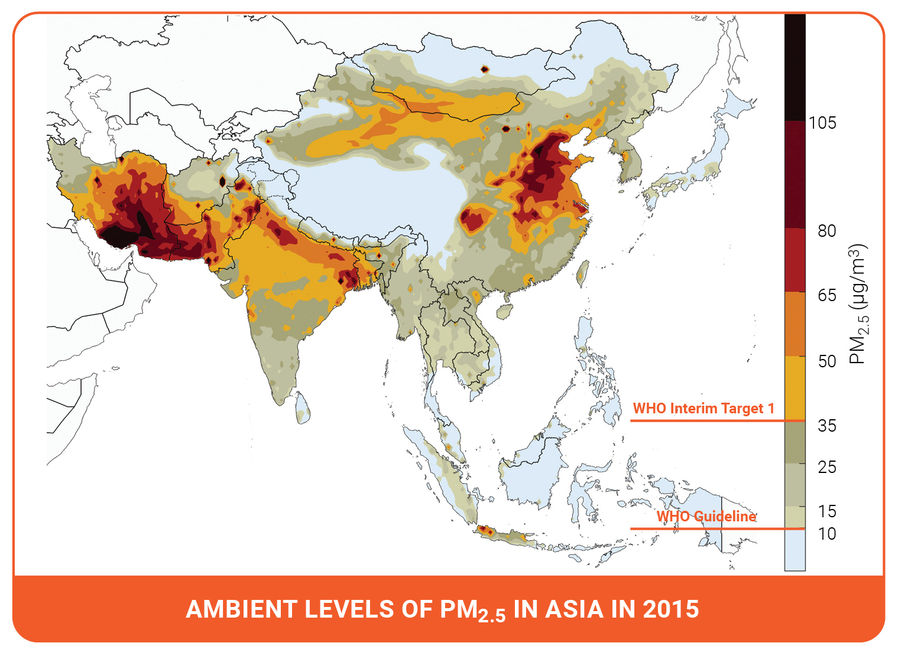

```{r setup, include=FALSE}
knitr::opts_chunk$set(echo = TRUE)
# Load all the packages needed here
library(tidyverse)
library(readr)
library(gt)
library(tufte)
library(sf)
library(mapview)

# Set your file path here! Or, set this up as an .Rproj if you'd like.
rootdir <- ("/Users/elkewindschitl/Documents/MEDS/eds-222/homework/assignment-01-elkewind")
datadir <- file.path(rootdir,"data")

# I won't be pushing my data file so it won't be stored on GitHub
```

*(The case study in this exercise is based on reality, but does not include actual observational data.)*

# Air Pollution in Lahore, Pakistan

```{r, out.width = "100%", echo=FALSE, fig.margin=TRUE}

```

In this exercise we will look at a case study concerning air quality in South Asia. The World Health Organization estimates that air pollution kills an estimated seven million people per year, due to its effects on the cardiovascular and respiratory systems. Out of the 40 most polluted cities in the world, South Asia is home to 37, and Pakistan was ranked to contain the second most air pollution in the world in 2020 (IQAIR, 2020). In 2019, Lahore, Pakistan was the 12th most polluted city in the world, exposing a population of 11.1 million people to increased mortality and morbidity risks.

In this exercise, you are given two datasets[^1] from Lahore, Pakistan and are asked to compare the two different data collection strategies from this city. These data are:

[^1]: All data for EDS 222 will be stored on the Taylor server, in the shared `/courses/EDS222/data/` directory. Please see material from EDS 214 on how to access and retrieve data from Taylor. These data are small; all compute can be handled locally. Thanks to Bren PhD student Fatiq Nadeem for assembling these data!

-   Crowd-sourced data from air quality monitors located in people's homes. These data are voluntarily collected by individual households who choose to install a monitor in their home and upload their data for public access.

-   Official government data from monitors installed by government officials at selected locations across Lahore. There have been reports that government officials strategically locate monitors in locations with cleaner air in order to mitigate domestic and international pressure to clean up the air.

In answering the following questions, please consider the lecture content from class on sampling strategies, as well as the material in Chapter 2 of [*Introduction to Modern Statistics*](https://openintro-ims.netlify.app/). Include in your submission an `.Rmd` file and a compiled `.html` file, each containing complete answers to all questions (as well as all your code in the `.Rmd`).

**Insert your answer in bold font like this below each question.**

## Question 1:

Load the data from each source and label it as `crowdsourced` and `govt` accordingly. For example:

```{r}
crowdsourced <- readRDS(file.path(datadir,"airpol-PK-crowdsourced.RDS"))
govt <- readRDS(file.path(datadir, "airpol-PK-govt.RDS"))
```

1.  These dataframes have one row per pollution observation. How many pollution records are in each dataset?

    **crowdsourced has 5488 records and govt has 1960 records.**

```{r}
print(nrow(crowdsourced))
print(nrow(govt))
```

2.  Each monitor is located at a unique latitude and longitude location. How many unique monitors are in each dataset?[^2]

    **There are 14 unique monitors in crowdsourced and 5 unique monitors in govt** (but it looks like some in each are at the same latitude or longitude).

[^2]: **Hint:** `group_by(longitude,latitude)` and `cur_group_id()` in `dplyr` will help in creating a unique identifier for each (longitude, latitude) pair.

```{r}
crowd_locations <-unique(crowdsourced[c("latitude", "longitude")])
govt_locations <- unique(govt[c("latitude", "longitude")])

# I originally did this assignment in the visual editor and could not see the hidden hints :( below I use the hint to find the answer:

crowdsourced_hint<- crowdsourced%>% 
  group_by(longitude,latitude) %>% 
  mutate(unique_id = cur_group_id())

length(unique(crowdsourced_hint$unique_id))

govt_hint<- govt%>% 
  group_by(longitude,latitude) %>% 
  mutate(unique_id = cur_group_id())

length(unique(govt_hint$unique_id))

```

## Question 2:

The goal of pollution monitoring in Lahore is to measure the average pollution conditions across the city.

1.  What is the *population* in this setting? Please be precise.

    **The population is all air in the city of Lahore.**

2.  What are the *samples* in this setting? Please be precise.

    **The samples are the pockets of air being measured at specific measuring locations both in some peoples homes and at government sites.**

3.  These samples were not randomly collected from across locations in Lahore. Given the sampling approaches described above, discuss possible biases that may enter when we use these samples to construct estimates of population parameters.

    **Because the in-home monitors are voluntary, the sample may skew towards evaluating wealthier homes rather than all homes/air. People would have had to purchase these air quality monitors and had the free time to report data. Additionally, the government may be intentionally trying to skew the data in favor of good air quality by placing the monitors in less polluted areas.**

## Question 3:

1.  For both the government data and the crowd-sourced data, report the sample mean, sample minimum, and sample maximum value of PM 2.5 (measured in $\mu g/m^3$).

    **Crowdsourced: mean = 70** $\mu g/m^3$**, min = 20** $\mu g/m^3$**, max = 120** $\mu g/m^3$

    **Government: mean = 40** $\mu g/m^3$**, min = 15** $\mu g/m^3$**, max = 65** $\mu g/m^3$

    (Answers rounded for significant figures)

```{r, include = TRUE, fig.margin = TRUE}
print(summary(crowdsourced$PM))
```

```{r, include = TRUE, fig.margin = TRUE}
print(summary(govt$PM))
```

2.  Discuss any key differences that you see between these two samples.

    **The sample mean, minimum, and maximum are all lower for the government samples than the crowdsourced samples. The mean and maximum especially appear to be low for the government samples.**

3.  Are the differences in mean pollution as expected, given what we know about the sampling strategies?

    **Yes. Given that there have been reports that the government was strategically placing monitors in locations with cleaner air, it makes sense that the sample statistics collected by the government were lower than the statistics from the crowdsourced data.**

## Question 4:

Use the location of the air pollution stations for both of the sampling strategies to generate a map showing locations of each observation. Color the two samples with different colors to highlight how each sample obtains measurements from different parts of the city.[^3]

[^3]: **Hint:** `longitude` indicates location in the *x*-direction, while `latitude` indicates location in the *y*-direction. With `ggplot2` this should be nothing fancy. We'll do more spatial data in `R` later in the course.

```{r, include = TRUE, out.width = "100%", echo = FALSE, fig.margin = TRUE}
# Add a label of crowd-sourced or govt to the location data
crowd_locations <- crowd_locations %>% 
  mutate(type = "crowdsourced")
govt_locations <- govt_locations %>% 
  mutate(type = "govt")

# Combine the crowd-sourced locations with the govt locations
all_locations <- rbind(govt_locations, crowd_locations)

mapview(all_locations, xcol = "longitude", ycol = "latitude", crs = 4269, grid = TRUE, zcol = "type")
# I'm not sure about the projection here... I didn't see any information on what to use in the metadata. I also didn't see the hint before writing this line, so here it is again in ggplot:
```

```{r, include = TRUE, out.width = "100%", echo = FALSE}
ggplot(data = all_locations, aes(x = longitude, y = latitude)) +
  geom_point(aes(color = type))
```

## Question 5:

The local newspaper in Pakistan, *Dawn*, claims that the government is misreporting the air pollution levels in Lahore. Do the locations of monitors in question 4, relative to crowd-sourced monitors, suggest anything about a possible political bias?

**Yes, the locations of the government monitors suggest bias because of their lack of representing the whole city. The govt monitors appear to be clustered together within \~1 km/within 0.01 degrees latitude of each other. The crowd-sourced monitors, however, are more spread out throughout the whole city.**

## Question 6:

Given the recent corruption in air quality reporting, the Prime Minister of Pakistan has hired an independent body of environmental data scientists to create an unbiased estimate of the mean PM 2.5 across Lahore using some combination of both government stations and crowd sourced observations.

NASA's satellite data indicates that the average PM across Lahore is 89.2 $\mu g/m^3$. Since this is the most objective estimate of population-level PM 2.5 available, your goal is to match this mean as closely as possible by creating a new ground-level monitoring sample that draws on both the government and crowd-sourced samples.

### Question 6.1:

First, generate a *random sample* of size $n=1000$ air pollution records by (i) pooling observations across the government and the crowd-sourced data;[^4] and (ii) drawing observations at random from this pooled sample.

[^4]: **Hint:** `bind_rows()` may be helpful.

```{r, include = TRUE, eval = TRUE}
# Label both sets as crowd-sourced or govt.
crowdsourced <- crowdsourced %>% 
  mutate(type = "crowdsourced")
govt <- govt %>% 
  mutate(type = "govt")

# Pool both data
all_data <- rbind(crowdsourced, govt)

# Draw a sample of 1000 from the pooled data
random_sample <- sample_n(all_data, 1000, replace = FALSE)

# Call the mean
print(mean(all_data$PM))
```

Second, create a *stratified random sample*. Do so by (i) stratifying your pooled data-set into strata of 0.01 degrees of latitude, and (ii) randomly sampling 200 air pollution observations from each stratum.

```{r, include = TRUE, eval = TRUE}
# Find the latitude range I'm working with
max(all_data$latitude)
min(all_data$latitude)

# Create levels of latitude by every 0.01 and assign those to the dataframe
levels <- seq(from = 31.550, to = 31.610, by = 0.01)
all_data$lat_group <- cut(all_data$latitude, breaks = levels, labels = c("1", "2", "3", "4", "5", "6"))

# Sample 200 observations from each latitude group
stratified <- all_data %>% 
  group_by(lat_group) %>% 
  sample_n(size = 200, replace = FALSE)

# Call the mean PM
print(mean(stratified$PM))
```

### Question 6.2:

Compare estimated means of PM 2.5 for each sampling strategy to the NASA estimate of 89.2 $\mu g/m^3$. Which sample seems to match the satellite data best? What would you recommend the Prime Minister do? Does your proposed sampling strategy rely more on government or on crowd-sourced data? Why might that be the case?

**The stratified sample mean (\~67** $\mu g/m^3$**) seems to match the NASA estimate closer than the non-stratified sample mean (62** $\mu g/m^3$**). Both are still a bit away from the NASA mean, though. I would recommend that the Prime Minister provide free monitors to households throughout the city to get a better representative sample of the city in addition to requesting that government sampling in Lahore be spread out and more representative of the whole city. This relies more on crowd-sourced data since the city of Lahore is not fairly reporting air quality, and it would hopefully bring the government data more up-to-par with the crowd-sourced data. This could be the case because the people of the city have more interest in fair air quality reporting than the city itself.**

```{r, include = TRUE, eval = TRUE}
# Call each mean to compare
print(mean(all_data$PM))
print(mean(stratified$PM))
```
